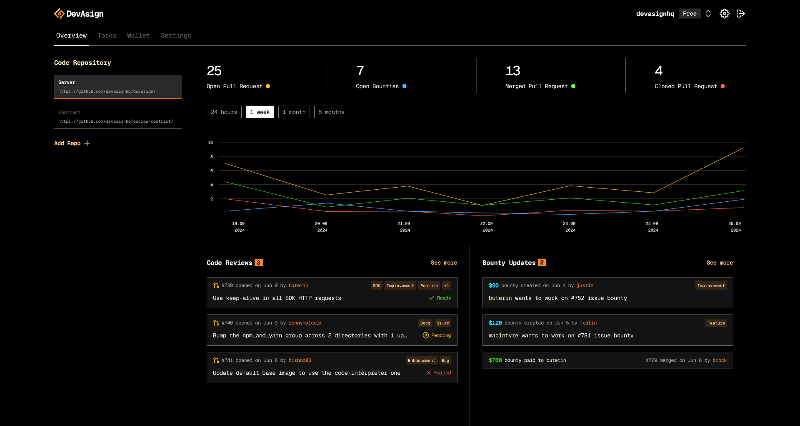

<br/>
<div align="center">
  <a href="https://www.devasign.com?ref=github" style="display: block; margin: 0 auto;">
    <picture>
      <source media="(prefers-color-scheme: dark)" srcset="./public/devasign-white.png">
      <source media="(prefers-color-scheme: light)" srcset="./public/devasign-black.png">
      
    </picture>
  </a>
<br/>

<br/>
</div>
<br/>

<div align="center">
    <a href="https://github.com/devasignhq/frontend?tab=Apache-2.0-1-ov-file">
  
<a href="https://GitHub.com/devasignhq/frontend/graphs/contributors">
  
</a>
<a href="https://devasign.com">
  
</a>
</div>
<div>
  <p align="center">
    <a href="https://x.com/devasign">
      
    </a>
    <a href="https://www.linkedin.com/company/devasign">
      
    </a>
  </p>
</div>


<div align="center">
  
  **Join our stargazers :)** 

  <a href="https://github.com/devasignhq/frontend">
    
  </a>

  <br/>
  </div>
  <br/>

  <div align="center">
    <a style="display: block; margin: 0 auto;">
      <picture>
        
      </picture>
    </a>
  </div>
  <br/>
  <div align="center">
    <a style="display: block; margin: 0 auto;">
      <picture>
        
      </picture>
    </a>
  </div>

## DevAsign Frontend

This monorepo contains both DevAsign frontend applications — the **Maintainer App** and the **Contributor App** — managed with [Turborepo](https://turbo.build/).

### Maintainer App

DevAsign Maintainer App empowers open-source project maintainers to:

- **Create & Manage Bounties**: Install DevAsign app on project repo. Add bounties to issues/tasks.
- **Monitor AI Reviews**: Oversee AI-powered pull request analysis and merge decisions.
- **Contributor Feedback**: Automatically generate and send contributor feedback based on PR review.
- **Track Contributors**: View contributor activity and reputation scores.
- **Manage Payments**: Process bounty payments on-chain through the Stellar blockchain network.
- **Configure Workflows**: Set up project-specific rules and automated approval thresholds.
- **Team Collaboration**: Manage team members and project settings.

### Contributor App

The contributor platform for discovering bounty tasks, submitting solutions, and receiving payments through the Stellar blockchain. The DevAsign Contributor App empowers open-source contributors to:

- **Discover Bounties**: Browse available tasks across multiple projects and repositories
- **Track Progress**: Monitor submissions, reviews, and payment status
- **Earn Rewards**: Receive instant payments via Stellar blockchain upon task completion
- **Collaborate**: Communicate with project maintainers and other contributors
- **Manage Earnings**: View payment history and manage crypto wallet

## Tech Stack

- **Framework**: Next.js 15 with React 19
- **Language**: TypeScript
- **Styling**: Tailwind CSS
- **State Management**: Zustand
- **Authentication**: Firebase Auth
- **HTTP Client**: Axios
- **Forms**: Formik with Yup validation
- **UI Components**: Custom components with React Icons
- **Monorepo**: Turborepo with npm workspaces

## Prerequisites

#### Required Software
- **Node.js** (version 18.0 or higher)
- **npm** (version 8.0 or higher) or **yarn** (version 1.22 or higher)
- **Git** (latest version)

#### Required Accounts & Services
- **DevAsign API Server** - Backend server must be running (see [server setup](https://github.com/devasignhq/devasign-api/))
- **Firebase Project** - for authentication services

## Installation & Setup

#### Step 1: Clone the Repository
```bash
git clone https://github.com/devasignhq/frontend.git
cd frontend
```

#### Step 2: Install Dependencies
```bash
# Using npm (installs dependencies for all apps and packages)
npm install
```

#### Step 3: Environment Configuration

Each app requires its own `.env.local` file.

1. Copy the example environment files:
```bash
cp apps/contributor/.env.example apps/contributor/.env.local
cp apps/pm/.env.example apps/pm/.env.local
```

2. Configure each `.env.local` file with the following variables:
```bash
# Firebase Configuration
NEXT_PUBLIC_FIREBASE_API_KEY="your-firebase-api-key"
NEXT_PUBLIC_FIREBASE_AUTH_DOMAIN="your-project.firebaseapp.com"
NEXT_PUBLIC_FIREBASE_PROJECT_ID="your-project-id"
NEXT_PUBLIC_FIREBASE_STORAGE_BUCKET="your-project.appspot.com"
NEXT_PUBLIC_FIREBASE_MESSAGING_SENDER_ID="123456789"
NEXT_PUBLIC_FIREBASE_APP_ID="1:123456789:web:abcdef"
NEXT_PUBLIC_FIREBASE_MEASUREMENT_ID="Q-SFQEFEEWEE"

# API Configuration
NEXT_PUBLIC_API_BASE_URL="api-url"

# App Configuration (PM app only)
NEXT_PUBLIC_NODE_ENV="development"
```

#### Step 4: Start the Development Server
```bash
# Run both apps simultaneously
npm run dev

# Run only the Maintainer app (http://localhost:3000)
npm run dev:pm

# Run only the Contributor app (http://localhost:4000)
npm run dev:contributor
```

## Project Structure

```
frontend/
├── apps/
│   ├── contributor/     # Contributor-facing Next.js app
│   └── pm/              # Project Maintainer-facing Next.js app
├── packages/
│   └── shared/          # Shared components, hooks, models, and utilities
├── package.json         # Root workspace config
└── turbo.json           # Turborepo pipeline config
```

## Configuration

#### Firebase Setup
1. Create a new Firebase project at [Firebase Console](https://console.firebase.google.com/)
2. Enable Authentication and choose GitHub as your preferred sign-in method
3. Get your Firebase configuration from Project Settings
4. Add the configuration values to each app's `.env.local` file

#### API Server Connection
1. Ensure the DevAsign API server is running (see [server setup](https://github.com/devasignhq/devasign-api/))
2. Update `NEXT_PUBLIC_API_BASE_URL` in each app's `.env.local` to point to your API server
3. Verify the connection by checking the health endpoint at `/health`

<!-- ## Contributing -->

### 🎯 Bounty Management
- **Task Creation**: Create bounty tasks with timeline and reward amounts
- **Label Integration**: Automatically sync with GitHub issue labels for seamless workflow
- **Progress Tracking**: Monitor task status from creation to completion and payment

## License

DevAsign is open-source software licensed under the Apache 2.0 License. See [LICENSE](https://github.com/devasignhq/frontend/blob/main/LICENSE) for more details.

<!-- ## Repo Activity

 -->

## Related Projects

- [DevAsign API Server](https://github.com/devasignhq/devasign-api) - Backend API and AI engine
- [Soroban Task Escrow Contract](https://github.com/devasignhq/soroban-contract) - Task Escrow Management
